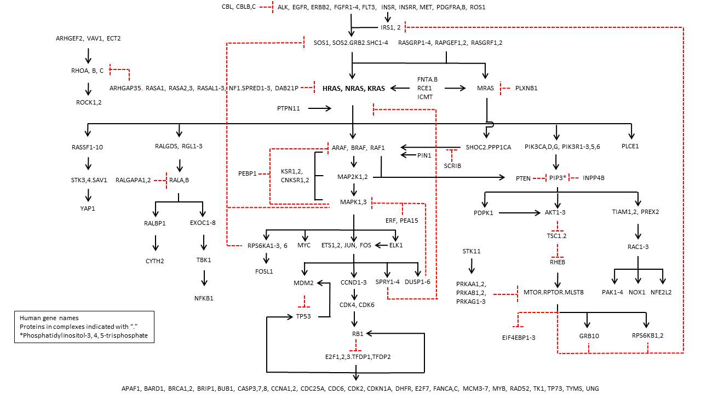
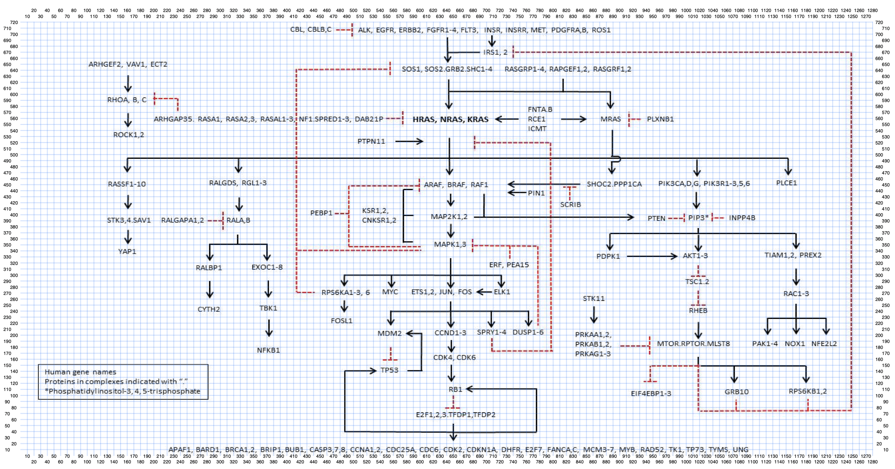
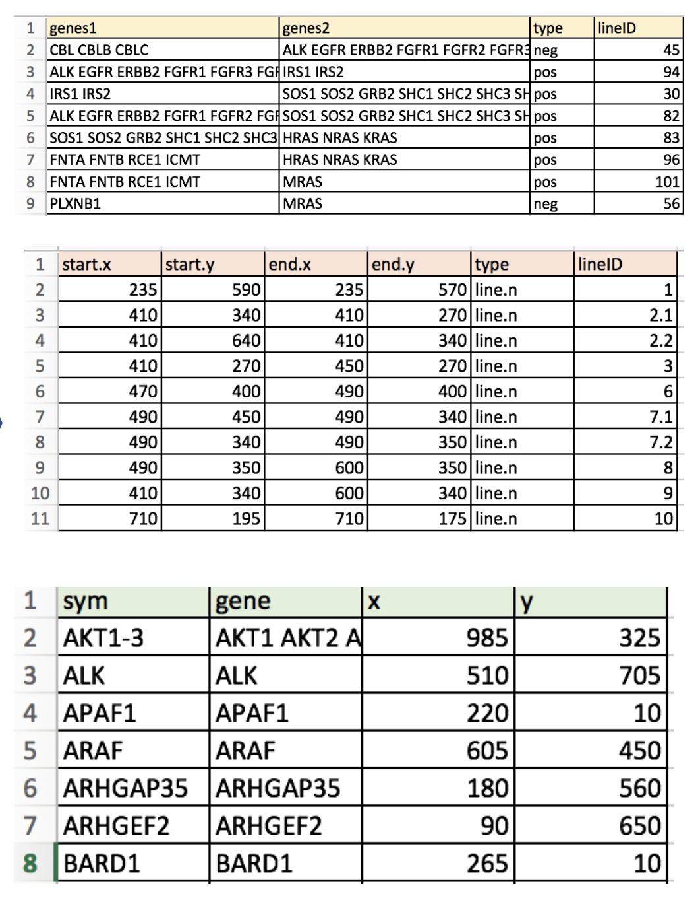
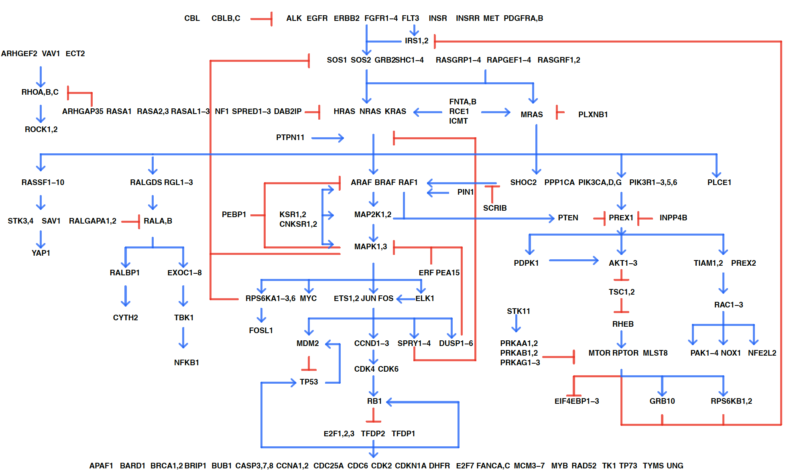
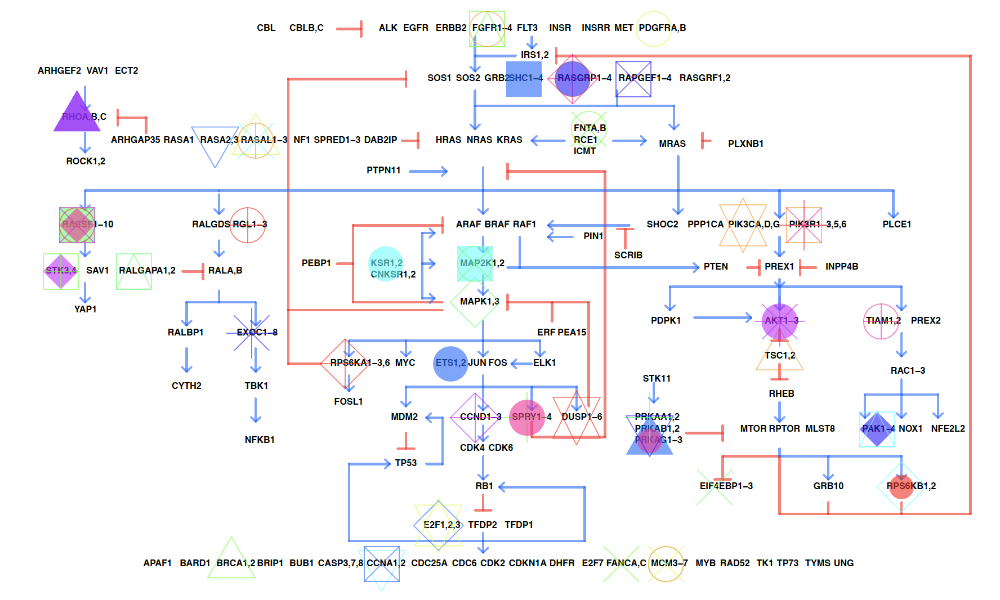
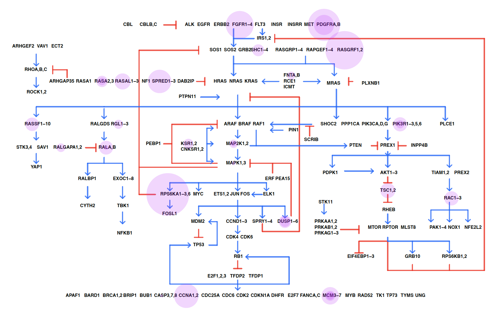
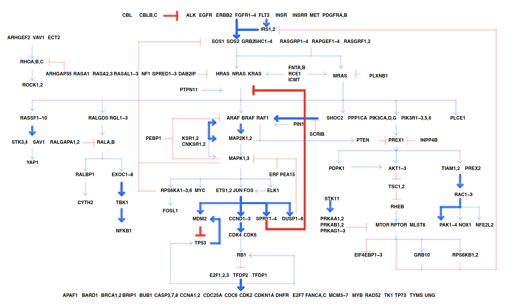
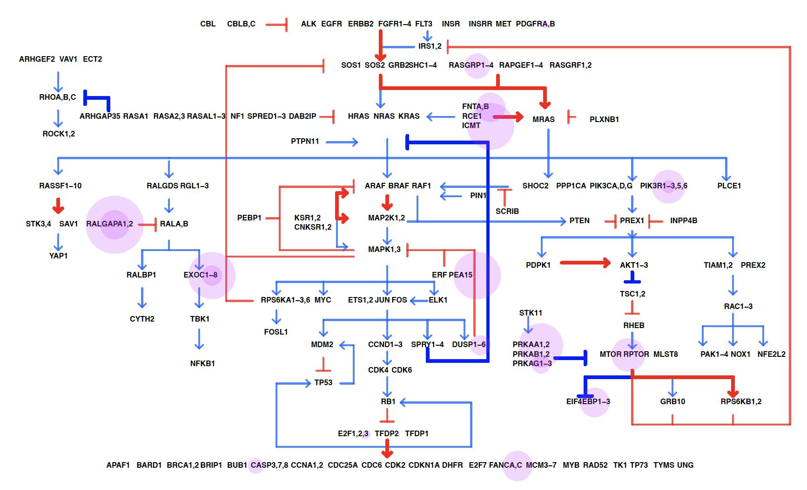
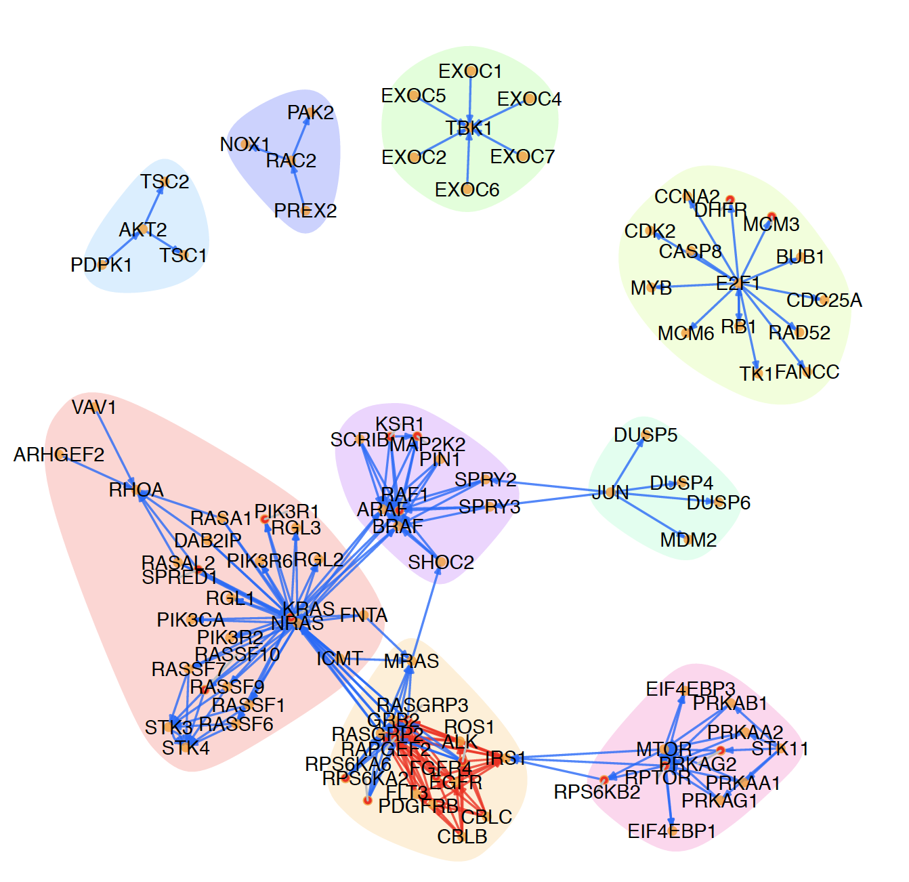

# NCIRASPathway: an R package that converts image pathway to degital pathway 
#### intall the package
```r
library(devtools)
install_github("CBIIT-CGBB/NCIRASPathway")
``` 
 
# Introduction
#### raw pathway image -> coordinators of image -> generation of digital tables -> digital pathway plot 
  
 
  


[R codes for grid](examples/01grid_image.R)  
[R codes for digital pathway plot](examples/01plot_ras-pathway.R)

# Examples
#### Map gene information on the pathway

 
[R codes](examples/02_1NCIRASPathway.R) 

#### Map gene mutations on the pathway

 
[R codes](examples/02_2NCIRASPathway.R)

#### Map gene associations on the pathway

 
[R codes](examples/02_3NCIRASPathway.R)

#### Map gene associations and mutations on the pathway

 
[R codes](examples/02_4ras-pathway-v2.R)

#### The networks by some genes in the pathway

 
[R codes](examples/02_5ras-pathway-v2.R)
